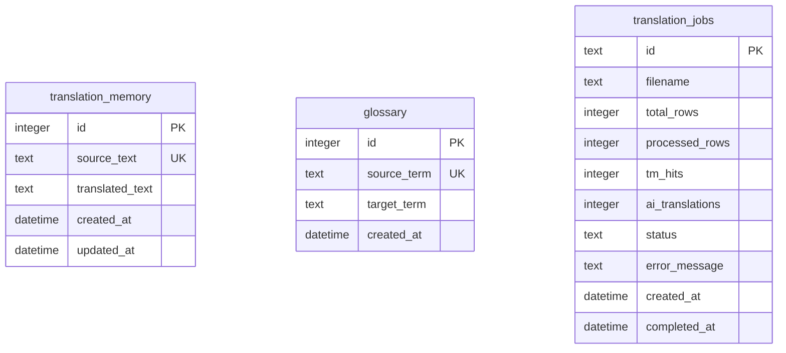

# Product Specification: LocFlow

This specification defines the functional, database, API, and UI design requirements for **LocFlow**, a personal game localization assistant with built-in translation memory and glossary management.

---

## 1. System Requirements & Constraints
*   **Target Files**: Excel workbooks (`.xlsx`) with two columns: Column A (Chinese source text), Column B (Vietnamese translation).
*   **Header handling**: Row 1 is treated as headers (skipped). Translation begins at Row 2.
*   **Multi-sheet support**: The tool automatically loops and processes all worksheets within the target file.
*   **Targeted processing**: Only empty or whitespace-only cells in Column B are translated. Pre-filled cells are preserved exactly.
*   **Font Formatting**: Cells translated by AI are styled as **bold** in the output file for easy review. Pre-existing cells and Translation Memory (TM) hits retain their regular font formatting.
*   **API Configuration**: The Gemini API key is loaded from a local `backend/.env` file.
*   **Cross-Table Uniqueness (Mutual Exclusivity)**: A term can only exist in the Glossary *or* the Translation Memory database, never both. This is enforced during Excel imports and inline edits to prevent duplicate/conflicting records.

---

## 2. Database Schema (SQLite)

We use SQLite via SQLAlchemy to store local configurations, memory lookups, glossaries, and job progress.

### Fields Definition

#### A. `translation_memory`
*   `id`: INTEGER, Primary Key
*   `source_text`: TEXT, Unique Index (Case-sensitive exact match, Nullable=False)
*   `translated_text`: TEXT, Nullable=False
*   `created_at`: DATETIME (Defaults to UTC now)
*   `updated_at`: DATETIME (Defaults to UTC now, auto-updates on modification)

#### B. `glossary`
*   `id`: INTEGER, Primary Key
*   `source_term`: TEXT, Unique Index (Case-sensitive exact match, Nullable=False)
*   `target_term`: TEXT, Nullable=False
*   `created_at`: DATETIME (Defaults to UTC now)

#### C. `translation_jobs`
*   `id`: TEXT, Primary Key (UUID)
*   `filename`: TEXT, Nullable=False
*   `total_rows`: INTEGER (Defaults to 0)
*   `processed_rows`: INTEGER (Defaults to 0)
*   `tm_hits`: INTEGER (Defaults to 0)
*   `ai_translations`: INTEGER (Defaults to 0)
*   `status`: TEXT (Allowed: `'PENDING'`, `'PROCESSING'`, `'COMPLETED'`, `'FAILED'`)
*   `error_message`: TEXT (Nullable)
*   `created_at`: DATETIME
*   `completed_at`: DATETIME (Nullable)

---

## 3. Backend API Endpoints (FastAPI)

### A. Translation Memory Management
*   `POST /api/memory/import`: Uploads a 2-column Excel dictionary and seeds the Translation Memory. Enforces cross-table uniqueness (skips terms already in Glossary or TM).
*   `GET /api/memory`: Paginated list of TM entries. Supports keyword searching (on Chinese or Vietnamese text) and sorting (`sort_order=desc` for Newest First, `sort_order=asc` for Oldest First).
*   `PUT /api/memory/{entry_id}`: Modifies a specific translation memory pair inline. Verifies cross-table uniqueness before saving.
*   `DELETE /api/memory/{entry_id}`: Deletes an individual entry.
*   `POST /api/memory/bulk-delete`: Deletes a list of TM entries by their database IDs.
*   `DELETE /api/memory`: Wipes all entries in the Translation Memory.
*   `GET /api/memory/export`: Exports the entire Translation Memory list to a 2-column Excel file (`.xlsx`) for download.

### B. Glossary Management
*   `POST /api/glossary/import`: Uploads a 2-column Excel glossary sheet. Enforces cross-table uniqueness (skips terms already in Glossary or TM).
*   `GET /api/glossary`: Paginated list of glossary rules. Supports searching and sorting (`sort_order=desc` / `asc` by date).
*   `PUT /api/glossary/{term_id}`: Modifies a specific glossary term inline. Verifies cross-table uniqueness before saving.
*   `DELETE /api/glossary/{term_id}`: Deletes an individual term.
*   `POST /api/glossary/bulk-delete`: Deletes a list of glossary terms by their database IDs.
*   `DELETE /api/glossary`: Wipes all terms in the Glossary.
*   `GET /api/glossary/export`: Exports the entire Glossary list to a 2-column Excel file (`.xlsx`) for download.

### C. File Translation Processing
*   `POST /api/translate/upload`: Uploads a target game Excel sheet. Accepts query param `save_to_tm: bool` (Auto-Save Toggle). Spawns background task and returns `job_id` immediately.
*   `GET /api/jobs/{job_id}`: Queries current job progress and yields remaining duration (ETA) calculations.
*   `GET /api/jobs/{job_id}/download`: Serves the localized Excel file.

---

## 4. AI Translation Mechanics (Gemini)
1.  **Direct Glossary Lookups (Bypassing AI)**: For each row, the engine checks for an *exact* match in the Glossary table. If found, it writes it directly to the cell, bypassing the AI API entirely (saves time and costs, counted as a TM hit).
2.  **Translation Memory Lookups**: If not found in the Glossary, the engine checks for an exact match in the `translation_memory` table. If found, it writes it directly (regular font, counted as a TM hit).
3.  **Batching**: Unmatched cells are grouped into chunks of 30.
4.  **Context Glossary Match**: For each chunk, the engine queries the Glossary table to identify terms that appear as substrings in the Chinese source strings.
5.  **Prompt Construction**: Constructs a system prompt instructing strict translation, conservation of formatting/variables, and adherence to the matched glossary terms. We enforce JSON structured schema outputs to ensure a 1:1 input/output mapping.
6.  **Writing & Formatting**: Translated target cells are formatted as **bold font** using `openpyxl`.
7.  **Auto-Save to TM**: If the auto-save toggle was checked, the new AI translations are written back into the Translation Memory database (guaranteeing cross-table uniqueness).

---

## 5. UI Page Layouts (React + Tailwind CSS v4)

### A. Shell Structure
*   A premium sidebar styled in dark Obsidian Slate (`bg-obsidian-950`) and glowing Indigo Accent gradient tabs. Links to **Dashboard**, **Translate File**, **Glossary Terms**, and **Translation Memory**.

### B. Dashboard
*   Aggregates system statistics: Total processed strings, Translation Memory reuse rate, size of Glossary, size of Translation Memory, and estimated hours saved.
*   Shows a table of the 5 most recent translation jobs with direct download links.

### C. Translate File View
*   Features a files dropzone staging files locally. 
*   **SheetJS Preview**: Renders the first sheet's top 10 rows before submission. Unresolved Vietnamese cells display a pulsing `To Translate` badge.
*   **Auto-Save Toggle**: A checkbox determines if the job's new AI translations populate the TM cache.
*   **Progress Indicators**: Shows active progress bars, percentage completed, TM hit counters, AI bold translation counters, and ETA time. Enables immediate downloading upon job completion.

### D. Glossary & Translation Memory Views
*   **Search**: A live input to filter terms by Chinese or Vietnamese characters.
*   **Sorting**: A selector to toggle between **Newest First** and **Oldest First**.
*   **Checkbox Selection**: Checkboxes on each row and a master select-all checkbox in the table header. Checking any row reveals a red **Delete Selected (N)** button.
*   **Inline Editing**: Click a pencil icon to edit terms in-place. Clicking checkmark saves it (displaying error callouts on uniqueness violations), while cross cancels it.
*   **Delete All**: A red-bordered **Delete All** button with a popup confirmation modal.
*   **Export Excel**: A white-bordered **Export Excel** button to download the entire list.
